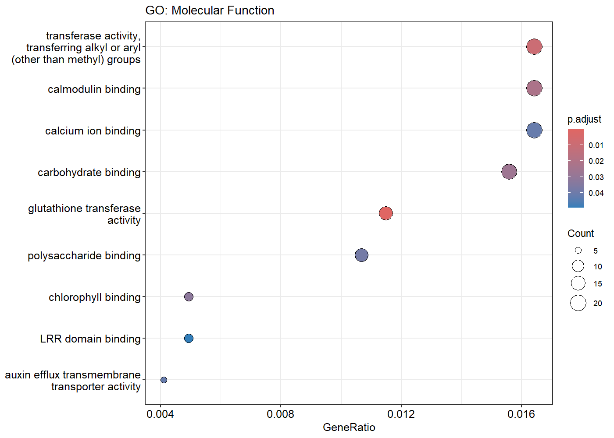

# **RNA-Seq Analysis Reveals Stress-Responsive Genes in Arabidopsis thaliana Vasculature**

### **Introduction**

Plants face many abiotic stresses that can disrupt their growth and survival. 
One of the most harmful is ultraviolet (UV) radiation, especially UV-C, which can damage DNA, generate reactive oxygen species (ROS), and impair normal cellular processes.

Arabidopsis thaliana, a widely used model plant, provides an excellent system for studying how plants respond to such stresses at the molecular level.

Berkowitz et al. (2021) showed that different leaf tissues (epidermis, mesophyll, vasculature) respond differently to stress. This project focuses on the vasculature, which plays a central role in transporting nutrients and signals.
By comparing UV-C treated vasculature samples with water-treated controls, we can identify genes that change expression under stress and uncover the biological pathways involved.

To achieve this, we used RNA sequencing (RNA-seq), a method that measures all RNA molecules in a sample at a specific time. RNA-seq captures these RNA molecules, converts them into stable DNA copies, and sequences them to quantify gene activity. 
This approach enables us to detect differentially expressed genes (DEGs), analyze changes in key biological pathways, and understand the molecular strategies plants employ to respond to UV stress.

### **Method**

This project aimed to analyze differential gene expression in Arabidopsis thaliana under a specific treatment condition using RNA sequencing (RNA-seq). 

The workflow included quality control (QC) of raw reads, trimming, alignment to the reference genome, counting mapped reads, differential expression analysis, and functional enrichment (GO and KEGG).

The objective was to identify significantly up- and down-regulated genes, explore enriched Gene Ontology (GO) terms in biological process (BP), molecular function (MF), and cellular component (CC), and investigate key pathways using KEGG enrichment.

### **Bash Workflow Scripts**

**Quality Control and Trimming**
```#!/bin/bash
# QC + trimming for raw files

fastqc -o $QC_RAW ${RAW_DIR}/*.fastq.gz
echo "MultiQC on raw reads" 
multiqc $QC_RAW -o $MULTIQC_RAW
#Define directories
RAW_DIR="plants/data/raw"
QC_RAW="plants/data/qc_raw"
TRIM_DIR="plants/data/trimmed"
QC_TRIM="plants/data/qc_trimmed"
MULTIQC_RAW="plants/data/multiqc_raw"
MULTIQC_TRIM="plants/data/multiqc_trimmed"

mkdir -p $QC_RAW $TRIM_DIR $QC_TRIM $MULTIQC_RAW $MULTIQC_TRIM

# QC on raw reads

# Trimming with fastp 
echo "Trimming with fastp"
for f in ${RAW_DIR}/*.fastq.gz; do
    base=$(basename $f .fastq.gz)
    out=${TRIM_DIR}/${base}_trim.fastq.gz
    json=${TRIM_DIR}/${base}_fastp.json
    html=${TRIM_DIR}/${base}_fastp.html

    fastp -i $f -o $out -j $json -h $html
done

# QC on trimmed reads
fastqc -o $QC_TRIM ${TRIM_DIR}/*.fastq.gz
echo "MultiQC on trimmed reads"
multiqc $QC_TRIM -o $MULTIQC_TRIM

echo "QC + trimming complete "
```
**Reference Genome Preparation**
``` #!/bin/bash
# Download Arabidopsis genome and annotation, build STAR index

cd ~/Tinuoluwanimi/plants/references

# Download Arabidopsis thaliana genome FASTA and annotation GTF
wget ftp://ftp.ensemblgenomes.org/pub/plants/release-59/fasta/arabidopsis_thaliana/dna/Arabidopsis_thaliana.TAIR10.dna.toplevel.fa.gz
wget ftp://ftp.ensemblgenomes.org/pub/plants/release-59/gtf/arabidopsis_thaliana/Arabidopsis_thaliana.TAIR10.59.gtf.gz

# Unzip files
gunzip -f Arabidopsis_thaliana.TAIR10.dna.toplevel.fa.gz
gunzip -f Arabidopsis_thaliana.TAIR10.59.gtf.gz

# Build STAR genome index
mkdir -p star_index

STAR \
  --runThreadN 8 \
  --runMode genomeGenerate \
  --genomeDir ./star_index \
  --genomeFastaFiles Arabidopsis_thaliana.TAIR10.dna.toplevel.fa \
  --sjdbGTFfile Arabidopsis_thaliana.TAIR10.59.gtf \
  --sjdbOverhang 100

echo "STAR genome index built successfully "
```
**STAR Alignment**
```#!/bin/bash
# STAR alignment 
#Define directories

TRIM_DIR="plants/data/trimmed"
STAR_INDEX="plants/references/star_index"
ALIGNMENTS_DIR="plants/alignments"
IGV_DIR="$ALIGNMENTS_DIR/IGV"

mkdir -p $ALIGNMENTS_DIR $IGV_DIR

echo "Running STAR alignment for single-end reads "
for f in ${TRIM_DIR}/*_trim.fastq.gz; do
    base=$(basename $f _trim.fastq.gz)
    outPrefix=${ALIGNMENTS_DIR}/${base}_

    STAR --runThreadN 8 \
         --genomeDir $STAR_INDEX \
         --readFilesIn $f \
         --readFilesCommand zcat \
         --outFileNamePrefix $outPrefix \
         --outSAMtype BAM SortedByCoordinate \
         --outSAMattributes All

    cp ${outPrefix}Aligned.sortedByCoord.out.bam $IGV_DIR/
done

# Index BAMs
for bam in $IGV_DIR/*.bam; do
    samtools index $bam
done


echo "STAR alignment complete "
```

**FeatureCounts**

```#!/bin/bash
# Run featureCounts on STAR-aligned BAM files 

MAPPED_DIR="plants/alignments/IGV"
OUT_DIR="plants/counts"
GTF="plants/references/Arabidopsis_TAIR10.59.gtf"

mkdir -p $OUT_DIR
OUT_FILE="$OUT_DIR/counts.txt"

echo "Running featureCounts "
featureCounts -T 8 \
  -a $GTF \
  -o $OUT_FILE \
  $MAPPED_DIR/*Aligned.sortedByCoord.out.bam

cd $OUT_DIR
echo "FeatureCounts complete "
```

**Differential Expression Analysis and Functional Enrichment(R)**
``` # DE_analysis_plant.R
# Differential expression + GO/KEGG enrichment for Arabidopsis

# Set working directory
setwd("C:/Users/User/Desktop/planta")  # adjust if needed

# Load libraries
suppressPackageStartupMessages({
  library(DESeq2); library(pheatmap); library(dplyr); library(ggplot2)
  library(clusterProfiler); library(org.At.tair.db); library(enrichplot); library(tibble)
})

# Read counts and metadata
fc <- read.delim("counts.txt", comment.char="#", header=TRUE, stringsAsFactors=FALSE)
meta <- read.csv("metadata.csv", header=TRUE, stringsAsFactors=FALSE)
if(!all(c("sample","condition") %in% colnames(meta))) stop("metadata.csv must have 'sample' and 'condition' columns.")

# Extract counts and clean column names
counts_raw <- fc[, c(1, 7:ncol(fc))]
rownames(counts_raw) <- counts_raw$Geneid
counts_raw <- counts_raw[, -1, drop=FALSE]
colnames(counts_raw) <- gsub("plants\\.alignments\\.IGV\\.|_Aligned\\.sortedByCoord\\.out\\.bam$", "", colnames(counts_raw))
meta$sample <- as.character(meta$sample)
if(!all(colnames(counts_raw) %in% meta$sample)) stop("Sample names mismatch between counts and metadata.")
meta <- meta[match(colnames(counts_raw), meta$sample), , drop=FALSE]

# Convert counts to numeric matrix and clean zeros/NAs
counts_mat <- apply(counts_raw, 2, as.integer)
rownames(counts_mat) <- rownames(counts_raw)
counts_mat[is.na(counts_mat)] <- 0
counts_mat <- counts_mat[rowSums(counts_mat) > 0, , drop=FALSE]

# Build DESeq2 object and run DE
meta$condition <- factor(meta$condition, levels=c("control","treatment"))
dds <- DESeqDataSetFromMatrix(countData=counts_mat, colData=meta, design=~condition)
dds <- DESeq(dds); res <- results(dds)
write.csv(as.data.frame(res), "Final_DESeq2_Results.csv", row.names=TRUE)

# Identify DEGs
upregulated <- subset(res, padj<0.05 & log2FoldChange>1)
downregulated <- subset(res, padj<0.05 & log2FoldChange< -1)
write.csv(as.data.frame(upregulated), "Upregulated_Genes.csv", row.names=TRUE)
write.csv(as.data.frame(downregulated), "Downregulated_Genes.csv", row.names=TRUE)

# Volcano plot
res_df <- as.data.frame(res); res_df$gene <- rownames(res_df)
png("VolcanoPlot.png", width=1400, height=1000, res=150)
plot(res_df$log2FoldChange, -log10(res_df$padj), pch=19, cex=0.5, col="grey",
xlab="Log2 Fold Change", ylab="-log10 Adjusted P-value", main="Volcano Plot")
abline(v=c(-1,1), col="darkblue", lty=2); abline(h=-log10(0.05), col="darkred", lty=2)
with(subset(res_df, padj<0.05 & log2FoldChange>1), points(log2FoldChange, -log10(padj), col="salmon", pch=19, cex=0.7))
with(subset(res_df, padj<0.05 & log2FoldChange< -1), points(log2FoldChange, -log10(padj), col="skyblue", pch=19, cex=0.7))
legend("topright", legend=c("Upregulated","Downregulated"), col=c("salmon","skyblue"), pch=19)
dev.off()
# Heatmap of top 50 DEGs
vsd <- vst(dds, blind=FALSE); vsd_mat <- assay(vsd)
sig_degs <- res[!is.na(res$padj) & res$padj<0.05, , drop=FALSE]
top50_genes <- if(nrow(sig_degs)==0) head(rownames(res)[order(res$padj, na.last=NA)],50) else rownames(sig_degs)[order(sig_degs$padj)][1:min(50,nrow(sig_degs))]
vsd_top50 <- vsd_mat[top50_genes, , drop=FALSE]
annotation_col <- data.frame(Condition=meta$condition); rownames(annotation_col) <- meta$sample
png("Heatmap_Top50.png", width=1400, height=1000, res=150)
pheatmap(vsd_top50, cluster_rows=TRUE, cluster_cols=TRUE, show_rownames=TRUE,
annotation_col=annotation_col, color=colorRampPalette(c("blue","white","red"))(60), main="Top 50 DEGs Heatmap")
dev.off()

# Extract significant DEGs
sig_degs_df <- as.data.frame(res) %>% rownames_to_column("gene") %>% filter(!is.na(padj) & padj<0.05)
write.csv(head(sig_degs_df[order(-abs(sig_degs_df$log2FoldChange)),],100), "Top100_DEGs.csv", row.names=FALSE)

# Map TAIR to ENTREZ
entrez_ids <- na.omit(mapIds(org.At.tair.db, keys=sig_degs_df$gene, column="ENTREZID", keytype="TAIR", multiVals="first"))
if(length(entrez_ids)>0){
# GO enrichment
go_list <- list(
BP=enrichGO(entrez_ids, OrgDb=org.At.tair.db, keyType="ENTREZID", ont="BP", pAdjustMethod="BH", pvalueCutoff=0.05, qvalueCutoff=0.05),
MF=enrichGO(entrez_ids, OrgDb=org.At.tair.db, keyType="ENTREZID", ont="MF", pAdjustMethod="BH", pvalueCutoff=0.05, qvalueCutoff=0.05),
CC=enrichGO(entrez_ids, OrgDb=org.At.tair.db, keyType="ENTREZID", ont="CC", pAdjustMethod="BH", pvalueCutoff=0.05, qvalueCutoff=0.05)
  )
lapply(names(go_list), function(n){
write.csv(as.data.frame(go_list[[n]]), paste0("GO_",n,"_results.csv"), row.names=FALSE)
if nrow(as.data.frame(go_list[[n]]))>0){
png(paste0("GO_",n,"_Dotplot.png"), width=1400, height=1000, res=150)
print(dotplot(go_list[[n]], showCategory=15)+ggtitle(paste("GO:",n)))
dev.off()
    }
  })
# KEGG enrichment
ekegg <- tryCatch({
enrichKEGG(gene=sig_degs_df$gene, organism="ath", keyType="kegg",
pvalueCutoff=0.05, pAdjustMethod="BH", qvalueCutoff=0.05)
}, error=function(e){warning("KEGG enrichment failed:", conditionMessage(e)); NULL})
if(!is.null(ekegg) && nrow(as.data.frame(ekegg))>0){
kegg_df <- as.data.frame(ekegg); write.csv(kegg_df,"KEGG_Enrichment.csv", row.names=FALSE)
write.csv(kegg_df %>% arrange(p.adjust) %>% head(5), "Top5_KEGG_Pathways.csv", row.names=FALSE)
png("KEGG_Dotplot.png", width=1400, height=1000, res=150)
print(dotplot(ekegg, showCategory=5)+ggtitle("Top 5 KEGG Pathways")); dev.off()
  } else warning("No significant KEGG pathways found.")
}
```
### **Results**

Summary Statistics
•	Upregulated genes

•	Downregulated genes

•	Top 100 differentially expressed genes

•	GO enrichment: Biological Process (BP)

•	GO enrichment: Molecular Function (MF)

•	GO enrichment: Cellular Component (CC)

•	Top 5 enriched pathways (KEGG)


### Top 10 Upregulated Genes

| Gene      | log2FC | padj     |
| --------- | ------ | -------- |
| AT1G49952 | 21.25  | 2.98e-11 |
| AT1G77655 | 20.93  | 6.97e-10 |
| AT1G80820 | 12.86  | 1.11e-24 |
| AT1G56250 | 12.59  | 6.70e-22 |
| AT1G32350 | 12.56  | 1.47e-23 |
| AT1G43160 | 12.22  | 1.49e-21 |
| AT1G19250 | 12.21  | 8.08e-21 |
| AT1G26380 | 12.05  | 1.67e-20 |
| AT1G51890 | 11.96  | 8.98e-20 |
| AT5G26920 | 11.86  | 2.61e-19 |

### Top 10 Downregulated Genes

| Gene      | log2FC | padj     |
| --------- | ------ | -------- |
| AT1G53160 | -10.91 | 2.86e-15 |
| AT1G19510 | -9.58  | 7.25e-10 |
| AT5G53080 | -9.04  | 6.12e-08 |
| AT1G09240 | -8.81  | 2.89e-07 |
| AT1G08393 | -8.64  | 4.21e-05 |
| AT1G33615 | -8.48  | 5.76e-05 |
| AT1G31173 | -8.42  | 9.81e-06 |
| AT1G49475 | -8.22  | 2.75e-05 |
| AT5G06790 | -8.11  | 3.36e-04 |
| AT1G09470 | -8.08  | 8.04e-05 |


### GO (Gene Ontology) Enrichment

**GO enrichment classifies genes based on three aspects:**

* **Biological Process (BP):** physiological or cellular processes, e.g., stress response, hormone signaling
* **Molecular Function (MF):** biochemical activity, e.g., transferase activity, glutathione metabolism
* **Cellular Component (CC):** cellular location of gene products, e.g., thylakoid or plastid membranes

**Biological Process (BP)**

| GO ID      | Description                                  |
| ---------- | -------------------------------------------- |
| GO:0036294 | cellular response to decreased oxygen levels |
| GO:0071453 | cellular response to oxygen levels           |
| GO:0001666 | response to hypoxia                          |
| GO:0009620 | response to fungus                           |
| GO:0009611 | response to wounding                         |
| GO:0009753 | response to jasmonic acid                    |
| GO:0042742 | defense response to bacterium                |
| GO:0050832 | defense response to fungus                   |
| GO:0009414 | response to water deprivation                |
| GO:0009723 | response to ethylene                         |

**Molecular Function (MF)**

| GO ID      | Description                                          |
| ---------- | ---------------------------------------------------- |
| GO:0004364 | glutathione transferase activity                     |
| GO:0016765 | transferase activity, transferring alkyl/aryl groups |
| GO:0005516 | calmodulin binding                                   |
| GO:0030246 | carbohydrate binding                                 |
| GO:0016168 | chlorophyll binding                                  |

**Cellular Component (CC)**

| GO ID      | Description                    |
| ---------- | ------------------------------ |
| GO:0048046 | apoplast                       |
| GO:0010494 | cytoplasmic stress granule     |
| GO:0009535 | chloroplast thylakoid membrane |
| GO:0009534 | chloroplast thylakoid          |
| GO:0055035 | plastid thylakoid membrane     |


### KEGG Enrichment (Top 5 Pathways)

KEGG pathway enrichment identifies metabolic and signaling pathways enriched among DEGs, showing how genes interact within the plant.

| Category           | Subcategory                     | KEGG ID  | Description                              |
| ------------------ | ------------------------------- | -------- | ---------------------------------------- |
| Metabolism         | Energy metabolism               | ath00710 | Carbon fixation by Calvin cycle          |
| Metabolism         | Metabolism of other amino acids | ath00480 | Glutathione metabolism                   |
| Metabolism         | Carbohydrate metabolism         | ath00630 | Glyoxylate and dicarboxylate metabolism  |
| Metabolism         | Amino acid metabolism           | ath00260 | Glycine, serine and threonine metabolism |
| Organismal Systems | Environmental adaptation        | ath04712 | Circadian rhythm - plant                 |


### Figures

 **Figure 1: Volcano Plot**

 


 **Figure 2. Heatmap of Top 50 Differentially Expressed Genes (DEGs)**

 


 **Figure 3. GO: Biological Process dotplot**
 


 **Figure 4. GO: Molecular Function dotplot**

 


 **Figure 5. GO: Cellular Component dotplot**

 


**Figure 6. KEGG Dotplot**


### **Discussion**
RNA-seq analysis revealed a strong response of Arabidopsis thaliana vasculature to UV stress, with 763 genes upregulated and 392 downregulated. Highly upregulated genes, such as AT1G49952 and AT1G77655, are likely involved in defense mechanisms and protection against oxidative damage, while downregulated genes, including AT1G53160 and AT1G19510, suggest that the plant temporarily suppresses growth-related processes to conserve resources. 

Gene Ontology (GO) enrichment highlights the biological roles of these genes: 

•	Biological Process (BP): Many genes are associated with stress responses, wounding, pathogen defense, and hormone signaling (e.g., jasmonic acid and ethylene), reflecting how the plant senses and reacts to UV-induced damage. 

•	Molecular Function (MF): Activities such as glutathione transferase and calmodulin binding indicate activation of antioxidant defenses and stress signaling pathways. Glutathione helps neutralize harmful reactive oxygen species (ROS), which are elevated during UV stress. 

•	Cellular Component (CC): Genes are localized in structures like thylakoid and plastid membranes, which are critical for photosynthesis, and the apoplast, which facilitates communication between cells during stress. This suggests the plant adjusts both energy production and intercellular signaling under UV exposure. 

KEGG pathway enrichment further shows how these genes work together in networks: 

•	Carbon fixation and amino acid metabolism: Reprogramming these metabolic pathways 

helps maintain energy balance and produce building blocks for stress-related proteins.

 •	Glutathione metabolism: Confirms activation of antioxidant defenses. 
 
•	Circadian rhythm: The plant’s internal clock coordinates stress responses, timing protective mechanisms to optimize energy use and minimize UV damage. 

This study demonstrates how RNA-seq enables us to see the global changes in gene expression under UV stress.
By connecting gene activity to specific pathways and cellular functions, we can better understand how Arabidopsis balances defense, metabolism, and growth to survive environmental challenges.  

This suggests that the plant not only enhances antioxidant defenses but also reprograms energy metabolism and growth cycles to survive UV exposure.


### **Conclusion**
UV treatment triggers a pronounced stress response in Arabidopsis thaliana, with upregulation of defense- and stress-related genes and downregulation of growth-associated pathways.

RNA-seq analysis allowed us to measure genome-wide gene expression changes, revealing how specific genes respond to UV exposure. 

GO enrichment highlighted stress signaling, detoxification, and cellular localization, while KEGG analysis identified coordinated metabolic and signaling pathways. 

Together, these results show how studying gene expression through transcriptomics can uncover the molecular mechanisms that contribute to plant stress adaptation and inform strategies that could be used to enhance plant stress tolerance.


### **Reference**
Berkowitz, O., Xu, Y., Liew, L. C., Wang, Y., Zhu, Y., Hurgobin, B., Lewsey, M. G., & Whelan, J. (2021). RNA-seq analysis of laser microdissected Arabidopsis thaliana leaf epidermis, mesophyll and vasculature defines tissue-specific transcriptional responses to multiple stress treatments. The Plant journal : for cell and molecular biology, 107(3), 938–955. https://doi.org/10.1111/tpj.15314
